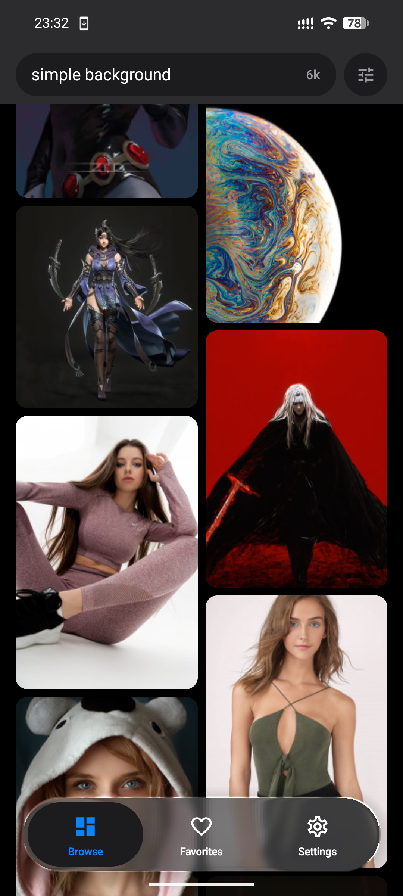
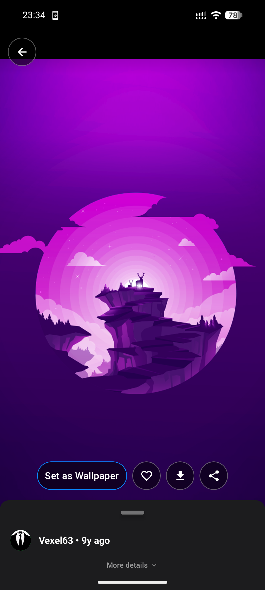
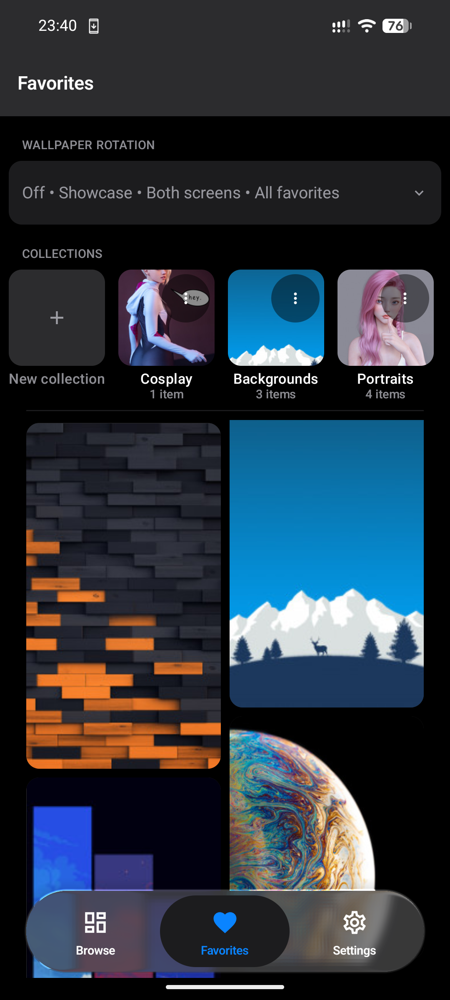

# WallKraft

Private wallpapers, crafted. A fast, offline-first wallpaper app for Android — powered by Wallhaven.

No ads. No analytics. No trackers. Your data never leaves your device.

<p align="center">
  
</p>

<p align="center">
  <a href="https://github.com/kedharsairam/wallkraft/releases/latest"></a>
  
  <a href="PRIVACY.md"></a>
  <a href="LICENSE"></a>
</p>

---

### Crafted

Every pixel has a reason. True-black OLED, Aurora palette, 8px rhythm, 12/20 radii, Liquid Glass tab bar with 4-layer frost. Light and dark, both first-class. 60fps, 44dp touch targets, haptics that mean something, ReduceMotion respected.

### Private

No accounts. No ads. No analytics. Your Wallhaven API key (optional) lives in the Android Keystore and never leaves the device — excluded from cloud backup, sent only as `X-API-Key` to Wallhaven. Favorites and downloads are local, atomic writes, never uploaded.

### Reliable

Offline-first. Search cache (30-min TTL, 100 entries, stale fallback), favorites disk (atomic tmp→rename, LRU 100MB), WorkManager chain (no polling, boundary-aligned, battery-not-low). Every network call returns `Result<AppError>` — no blank screens, no silent failures.

---

## Features

**Browse** — Masonry grid, adaptive columns, pull-to-refresh (below top bar, `500ms` hold, light haptic), skeleton sweep, prefetch, shared-element hero (tile → detail).

**Search & Filter** — Text search with history/suggestions; categories, purity (SFW/Sketchy/NSFW gated), orientation, Wallhaven color pills (29→8 families), sorting `relevance→hot` + toplist time range. Filters persist.

**Detail** — Full-bleed, edge-to-edge behind status bar. Pinch + 3-step double-tap (fit→fill→native, hard-lock at fill), tags, uploader, stats. Share via FileProvider.

**Set** — Frame with crop/zoom, Home/Lock/Both, remembered framing. Showcase/Atmosphere blur.

**Favorites** — Full-res offline copies, custom collections (many-to-many, covers, counts), multi-select, batch remove, offline re-validation. Horizontal strip to filter.

**Rotation** — Auto-rotate favorites or one collection (Hourly/Daily/Weekly, exactly on :00/midnight/Monday), manual Rotate now, showcase blur.

<details>
<summary><strong>Tech Stack</strong></summary>

| Layer | Technology |
|---|---|
| Language | Kotlin 2.1 |
| UI | Jetpack Compose + Material 3 |
| DI | Hilt 2.52 |
| Networking | OkHttp + kotlinx.serialization |
| Images | Coil 3 (disk 512MB, mem 25%) |
| Database | Room 2.6 (v4), DataStore |
| Security | EncryptedSharedPreferences AES256-GCM |
| Architecture | MVVM + Repository, `Result<AppError>` |
| Tests | 414 unit + 76 instrumented |

</details>

<details>
<summary><strong>Build</strong></summary>

```bash
cd android
./gradlew assembleDebug      # → android/app/build/outputs/apk/debug/app-debug.apk
./gradlew test               # unit
./gradlew connectedAndroidTest # instrumented (pixel_6)
```

</details>

<details>
<summary><strong>Project Structure</strong></summary>

```
android/app/src/main/java/com/wallkraft/app/
├── core/design   Theme (Light/Dark), tokens
├── core/errors   AppError, Result
├── data          api/cache/db/mappers/prefs/repository
├── di            AppModule (Hilt)
├── domain        model/collection (pure), repository
├── presentation  browse/detail/favorites/settings/common/components
└── WallKraftApplication + WallKraftNavHost
```

</details>

## Screenshots

| Browse | Detail | Favorites |
|--------|--------|-----------|
|  |  |  |

> Add `browse.png`, `detail.png`, `favorites.png` to `docs/screenshots/` — 1 hero + 3 above.

## Privacy

Private by default. See [PRIVACY.md](PRIVACY.md).

## Support

If you enjoy WallKraft, buy me a coffee:

<p align="center">
  <a href="https://buymeacoffee.com/kedhartech"></a>
</p>

## License

[MIT](LICENSE)
