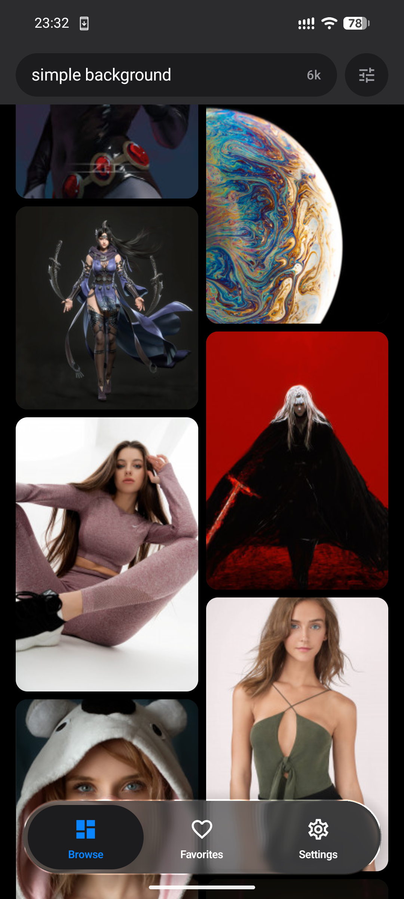
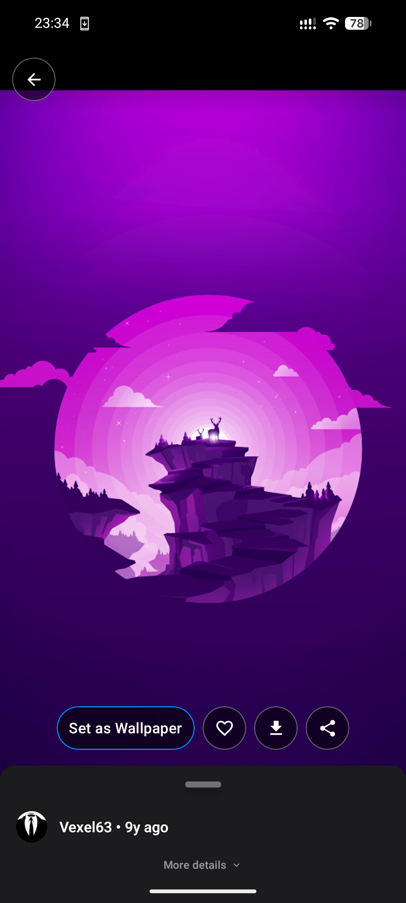
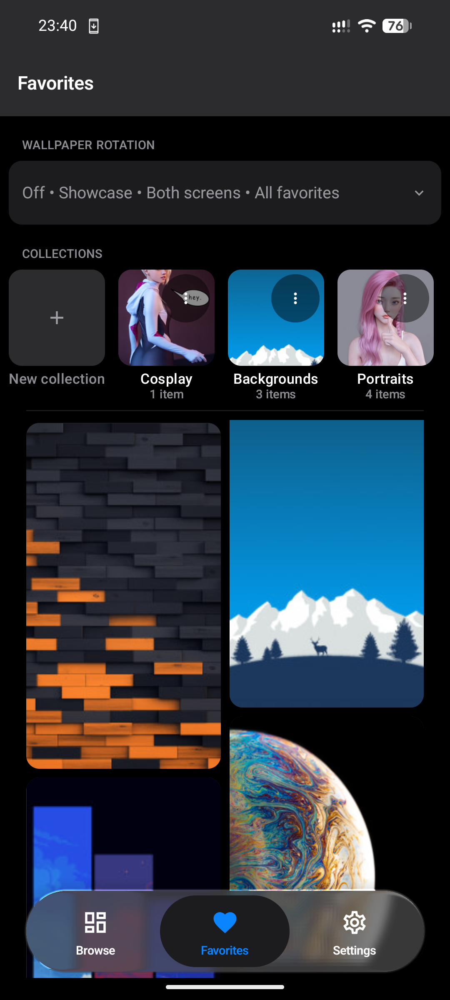

# WallKraft

Private wallpapers, crafted. A fast wallpaper browser for Wallhaven — browse, search, favourite, and set, with the timetables and cache doing the work.

No accounts. No ads. No analytics. No trackers. Your data never leaves your device.

<p align="center">
  <a href="https://github.com/kedharsairam/wallkraft/releases/latest"></a>
  
</p>

---

## Crafted

True-black OLED, an Aurora palette, an 8px spacing rhythm, 12/20 corner radii, and a Liquid Glass tab bar with four layers of frost. Light and dark, both first-class rather than one being the other with the colours inverted. 60fps, 44dp touch targets, haptics that mean something, and ReduceMotion respected.

## Private

Your Wallhaven API key is optional. It lives in the Android Keystore, is excluded from cloud backup, and is sent only as an `X-API-Key` header to Wallhaven. Favourites and downloads are local, written atomically, and never uploaded.

## Reliable

Search cache with a 30-minute TTL over 100 entries and a stale fallback. Favourites on disk via atomic write-then-rename, capped at 100MB by LRU. A WorkManager chain instead of polling, aligned to boundaries and gated on battery-not-low. Every network call returns a `Result<AppError>`, so there are no blank screens and no silent failures.

## Permissions

| Permission | Why |
| --- | --- |
| `INTERNET` | Wallhaven. There is no other destination. |
| `ACCESS_NETWORK_STATE` | To show an offline state instead of an empty grid |
| `SET_WALLPAPER` | The entire point of the app |
| `POST_NOTIFICATIONS` | Download and set confirmations |
| `WRITE_EXTERNAL_STORAGE` | Saving to shared storage — declared with `maxSdkVersion="28"`, so it is never requested on a modern device |
| `BIND_QUICK_SETTINGS_TILE` | The optional tile for setting a wallpaper without opening the app |

No camera. No location. No microphone. No contacts.

---

## Features

**Browse** — Masonry grid, adaptive columns, pull-to-refresh below the top bar with a 500ms hold and a light haptic, skeleton sweep, prefetch, and a shared-element hero from tile to detail.

**Search and filter** — Text search with history and suggestions; categories, purity (SFW/Sketchy/NSFW gated), orientation, Wallhaven colour pills folded from 29 into 8 families, and sorting across `relevance → hot` with a toplist time range. Filters persist.

**Detail** — Full-bleed, edge-to-edge behind the status bar. Pinch plus a three-step double-tap (fit → fill → native, hard-locked at fill), tags, uploader and stats. Share through a FileProvider.

**Set** — Frame with crop and zoom, Home/Lock/Both, remembered framing, and showcase or atmosphere blur.

**Favourites** — Full-resolution local copies, custom collections with covers and counts, multi-select, batch removal, and re-validation. A horizontal strip doubles as a filter.

**Rotation** — Auto-rotate favourites or a single collection hourly, daily or weekly, firing exactly on the hour, midnight and Monday. Manual *Rotate now* as well, with showcase blur.

## Screenshots

<p align="center">
   &nbsp;&nbsp;
   &nbsp;&nbsp;
  
</p>

---

<details>
<summary><strong>Tech stack</strong></summary>

| Layer | Technology |
|---|---|
| Language | Kotlin 2.1 |
| UI | Jetpack Compose + Material 3 |
| DI | Hilt 2.52 |
| Networking | OkHttp + kotlinx.serialization |
| Images | Coil 3 (disk 512MB, mem 25%) |
| Database | Room 2.6 (v4), DataStore |
| Security | EncryptedSharedPreferences AES256-GCM |
| Architecture | MVVM + Repository, `Result<AppError>` |
| Tests | 372 unit + 72 instrumented |

</details>

<details>
<summary><strong>Build from source</strong></summary>

**Prerequisites:** JDK 17, Android SDK, Git.

```bash
git clone https://github.com/kedharsairam/wallkraft.git
cd wallkraft/android

./gradlew assembleDebug      # app/build/outputs/apk/debug/app-debug.apk
./gradlew assembleRelease    # requires a signing config in gradle.properties

./gradlew test                    # 372 unit tests
./gradlew connectedAndroidTest    # 72 instrumented, device required

./gradlew spotlessCheck           # check formatting
./gradlew spotlessApply           # auto-fix
```

</details>

<details>
<summary><strong>Project structure</strong></summary>

```
android/app/src/main/java/com/wallkraft/app/
├── core/design   Theme (Light/Dark), tokens
├── core/errors   AppError, Result
├── data          api/cache/db/mappers/prefs/repository
├── di            AppModule (Hilt)
├── domain        model/collection (pure), repository
├── presentation  browse/detail/favorites/settings/common/components
└── WallKraftApplication + WallKraftNavHost
```

</details>

## Privacy

Private by default. See [PRIVACY.md](PRIVACY.md).

## Design

Spacing, type, radius, motion and touch targets come from
[kraft-foundation](https://github.com/kedharsairam/kraft-foundation), which is also where the
standard this app is built to is written down. It targets **standard 1.0.0**, and
`kraft-lint` in that repository is what checks it.

This app previously carried its own copies of all four token objects under the same names —
`KraftSpacing`, `KraftRadius`, `KraftIconSize`, `KraftTypeScale` — with identical values.
They are deleted; the imports now point at the foundation. What stays local is what would
be wrong anywhere else: the Aurora palette (eight system accents plus measured surfaces),
the three-way light/dark/AMOLED theme, `KraftConstants` (cache TTLs, rate limits, and the
app's own dimensions like `GridTileMin` and `CollectionCardSize`), and the lockscreen mock
clock face.

WallKraft is the fifth of nine apps to move. Its toolchain moved with it: Gradle 8.11.1 →
9.7.1, AGP 8.9.1 → 9.3.1, Kotlin 2.1.0 → 2.2.10, Hilt 2.56 → 2.60 (2.56 cannot see AGP 9's
APIs), SDK 36 → 37.

## Support

If you enjoy WallKraft, buy me a coffee:

<p align="center">
  <a href="https://buymeacoffee.com/kedhartech"></a>
</p>

## License

[MIT](LICENSE)
